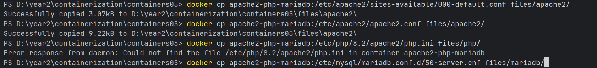
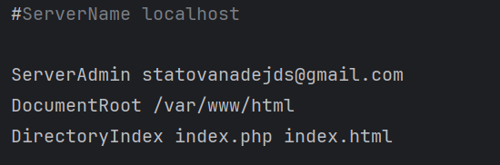
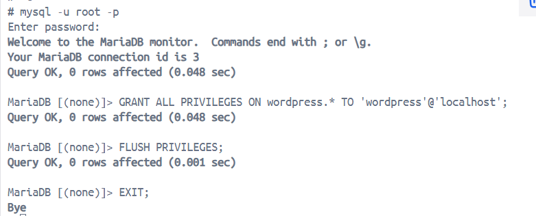
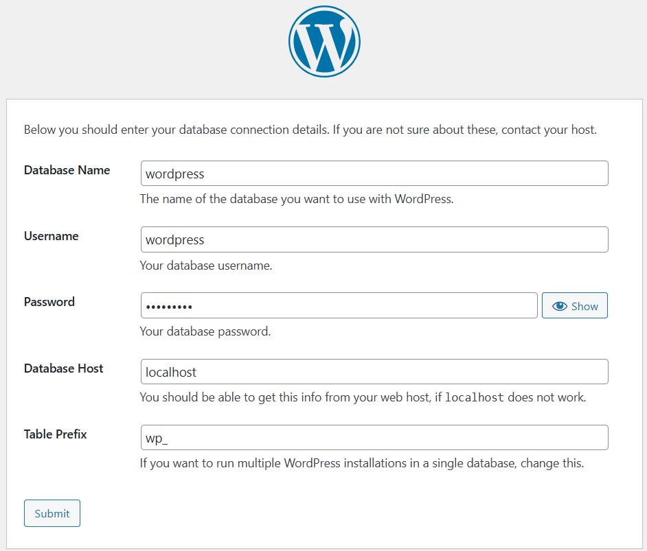
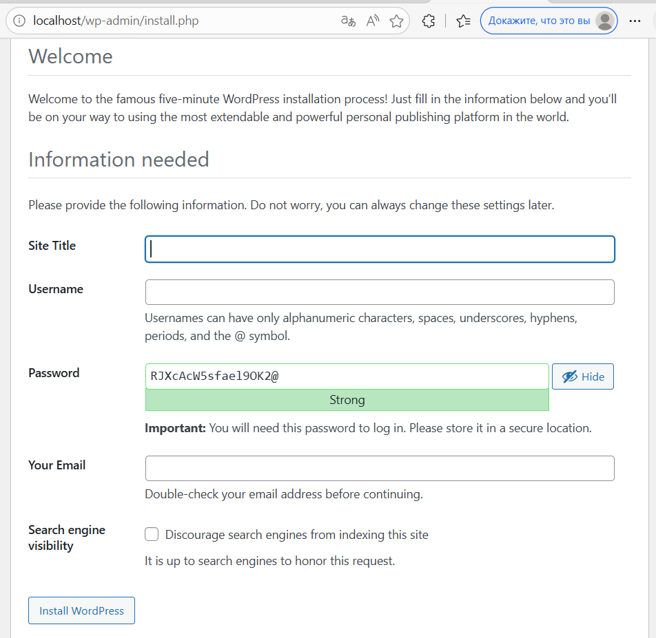

## Лабораторная работа №5: Запуск сайта в контейнере

### Цель работы
Выполнив данную работу мы сможем подготовить образ контейнера для запуска веб-сайта на базе Apache HTTP Server + PHP (mod_php) + MariaDB.

### Задание 
Создать Dockerfile для сборки образа контейнера, который будет содержать веб-сайт на базе Apache HTTP Server + PHP (mod_php) + MariaDB. База данных MariaDB должна храниться в монтируемом томе. Сервер должен быть доступен по порту 8000.
Установить сайт WordPress. Проверить работоспособность сайта.


#### Извлечение конфигурационных файлов apache2, php, mariadb из контейнера
Для начала создаем репозиторий и клонируем к себе локально. Создаем папку files добавляем туда файлы, где будут будущие конфигурации apache2, php, mariadb;

В Dockerfile добавляем строки, которые скачают эти конфигурации 

```dockerfile
# create from debian image
FROM debian:latest

# install apache2, php, mod_php for apache2, php-mysql and mariadb
RUN apt-get update && \
    apt-get install -y apache2 php libapache2-mod-php php-mysql mariadb-server && \
    apt-get clean \
```

Построим образ контейнера с именем apache2-php-mariadb.
```bash
docker build -t apache2-php-mariadb . 
```
Построим образ и на его основе создаем контейнер apache2-php-mariadb из образа apache2-php-mariadb и запускаем его в фоновом режиме с командой запуска bash.

```dockerfile
docker run -d --name apache2-php-mariadb -it apache2-php-mariadb bash
```

Копируем из контейнера файлы конфигурации apache2, php, mariadb в папку files/ на компьютере. Для этого, в контексте проекта, выполняем команды:



Проверяем наличие файлов конфигурации, Останавливаем и удаляем раннее созданный контейнер 

```dockerfile
docker stop apache2-php-mariadb
docker rm apache2-php-mariadb
```

#### Настройка конфигурационных файлов. Конфигурационный файл apache2

В файле files/apache2/000-default.conf: 
- `#ServerName www.example.com` заменяем на `ServerName localhost`
- `ServerAdmin webmaster@localhost` заменяем на `statovanadejds@gmail.com`
- Добавляем `DirectoryIndex index.php index.html` после строки `DocumentRoot /var/www/html`
- В конце файла `files/apache2/apache2.conf` добавляем строку `ServerName localhost`



Сохраняем и закрываем файлы.

#### Конфигурационный файл php

В файле `files/php/php.ini`: 
- Заменяем `;error_log = php_errors.log` на `error_log = /var/log/php_errors.log.`
- Настраиваем параметры `memory_limit`, `upload_max_filesize`, `post_max_size`, `max_execution_time`:
  memory_limit = 128M
  upload_max_filesize = 128M
  post_max_size = 128M
  max_execution_time = 120

Сохраняем и закрываем файл. 

#### Конфигурационный файл mariadb

Раскомментируем строку `#log_error = /var/log/mysql/error.log ` в файле `files/mariadb/50-server.cnf`

Сохраняем и закрываем файл. 

#### Создание скрипта запуска

Создаем в папке files папку supervisor и файл supervisord.conf со следующим содержимым:

```bash
[supervisord]
nodaemon=true
logfile=/dev/null
user=root

# apache2
[program:apache2]
command=/usr/sbin/apache2ctl -D FOREGROUND
autostart=true
autorestart=true
startretries=3
stderr_logfile=/proc/self/fd/2
user=root

# mariadb
[program:mariadb]
command=/usr/sbin/mariadbd --user=mysql
autostart=true
autorestart=true
startretries=3
stderr_logfile=/proc/self/fd/2
user=mysql
```

#### Создание Dockerfile 

После инструкции FROM добавляем монтирование томов:

```dockerfile
# mount volume for mysql data
VOLUME /var/lib/mysql

# mount volume for logs
VOLUME /var/log
```

Добавляем инструкции для копирования и распаковки сайта Wordpres: 

```dockerfile
# add wordpress files to /var/www/html
ADD https://wordpress.org/latest.tar.gz /var/www/html/
```

После копирования файлов WordPress добавляем копирование конфигурационных файлов apache2, php, mariadb, а также скрипта запуска:

```dockerfile
# copy the configuration file for apache2 from files/ directory
COPY files/apache2/000-default.conf /etc/apache2/sites-available/000-default.conf
COPY files/apache2/apache2.conf /etc/apache2/apache2.conf

# copy the configuration file for php from files/ directory
COPY files/php/php.ini /etc/php/8.2/apache2/php.ini

# copy the configuration file for mysql from files/ directory
COPY files/mariadb/50-server.cnf /etc/mysql/mariadb.conf.d/50-server.cnf
```

Для функционирования mariadb создаем папку `/var/run/mysqld` и устанавливаем права на неё:

```dockerfile
# create mysql socket directory
RUN mkdir /var/run/mysqld && chown mysql:mysql /var/run/mysqld
```

Открываем порт 80 и добавляем команду запуска `supervisord`

```dockerfile
# start supervisor
CMD ["/usr/bin/supervisord", "-n", "-c", "/etc/supervisor/conf.d/supervisord.conf"]
```

#### Создание базы данных и пользователя

Собираем образ и запускаем контейнер. Создаем базу данных wordpress и пользователя wordpress с паролем wordpress в контейнере apache2-php-mariadb. Для этого, в контейнере apache2-php-mariadb, выполняем команды:



#### Создание файла конфигурации WordPress

Открываем в браузере сайт WordPress по адресу http://localhost/. Указываем параметры подключения к базе данных:



Копируем содержимое файла конфигурации в файл files/wp-config.php на компьютере.

#### Добавление файла конфигурации WordPress в Dockerfile

Добавляем в файл Dockerfile следующие строки:

```dockerfile
# copy the configuration file for wordpress from files/ directory
COPY files/wp-config.php /var/www/html/wordpress/wp-config.php
```

#### Тестируем: 

Пересобираем образ контейнера с именем apache2-php-mariadb и запускаем контейнер apache2-php-mariadb из образа apache2-php-mariadb. Проверяем работоспособность сайта WordPress. Открывается сайт Wordpress, а значит все работает как и предполагалось 



#### Контрольные вопросы: 

1. **Какие файлы конфигурации были изменены?**

- apache2: 000-default.conf, apache2.conf 
- php: php.ini 
- mariadb: 50-server.cnf 
- WordPress: wp-config.php

2. **За что отвечает DirectoryIndex?**

Определяет, какой файл открывать по умолчанию (например index.php, index.html).

3. **Зачем нужен wp-config.php?**

Хранит настройки подключения к базе данных. Без него WordPress либо запускает установку, либо не может подключиться.

4. **За что отвечает post_max_size?**

Максимальный размер данных, отправляемых через POST (например загрузка файлов в WordPress).

5. **Недостатки образа контейнера:**

- Все сервисы (Apache, PHP, MariaDB) находятся в одном контейнере, тогда как обычно каждый сервис создается в отдельном контейнере
- База данных не инициализируется автоматически - её нужно создавать вручную через mysql.
- Образ получается достаточно тяжёлым из-за установки всех компонентов сразу

### Вывод 

В ходе работы был создан Docker-образ, в котором запущен сайт на базе Apache, PHP и MariaDB. Также был установлен и настроен WordPress, который успешно открылся в браузере. В процессе работы были изучены этапы для настройки основных конфигурационных файлов и принципы их настройки, а также дополнен опыт работы с Docker и запуском веб-приложения в контейнере.

Однако, несмотря на успешный результат, было отмечено, что настройка требовала выполнения многих действий вручную, что в реальности может приводить к ошибкам. Также стоит отметить другой недостаток созданного образа - объединение всех сервисов в одном контейнере делает решение менее удобным и гибким.

